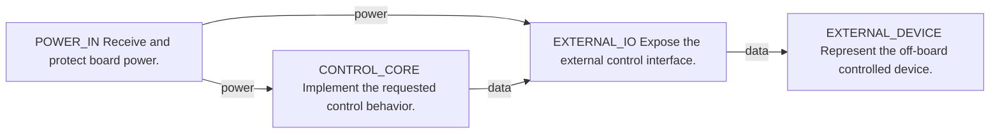

# pass_part_selection_basic Block Architecture

- Architecture revision: 1
- Source intake revision: 1
- State: ready
- Current target: production-package
- Confirmation SHA256: 599fb397fc1adbe819c614ef6314ad0745384e114d7f63132223e254cfe7a2c8
- Architecture SHA256: e6f86a6813a44b0c3be5ceeecc5e4708878dcb869df75130fb10885730251d90
- Summary: A protected power entry feeds a controller and a connector-facing external interface.

## Block Diagram

## Power Domains

| id | source_block | consumer_blocks | voltage_class | current_class |
| --- | --- | --- | --- | --- |
| LOGIC_POWER | POWER_IN | CONTROL_CORE, EXTERNAL_IO | regulated_low_voltage | low |

## External Connectors

| id | block_id | exposure | hot_plug | protection_intent |
| --- | --- | --- | --- | --- |
| CONNECTOR_EXTERNAL | EXTERNAL_IO | user_accessible | no | required |

## Risk Paths

| id | kind | block_ids | interface_ids | constraints |
| --- | --- | --- | --- | --- |
| RISK_EXTERNAL_CABLE | external_cable | EXTERNAL_IO, EXTERNAL_DEVICE | EXTERNAL_LINK | Keep boundary protection close to the connector. |

## Open Decisions

None.

## Sourcing Constraints

| block_id | id | kind | statement | criteria | required_before |
| --- | --- | --- | --- | --- | --- |
| POWER_IN | POWER_INPUT_CAPABILITY | power | Provide the logic power domain and declared boundary protection. | {'attribute': 'functions', 'operator': 'contains', 'value': 'protected_power_entry'} | component-sourcing |
| CONTROL_CORE | CONTROL_FUNCTION_CAPABILITY | function | Implement the control and recovery behavior. | {'attribute': 'functions', 'operator': 'contains', 'value': 'programmable_control'} | component-sourcing |
| EXTERNAL_IO | EXTERNAL_INTERFACE_CAPABILITY | interface | Provide the exposed interface and boundary protection. | {'attribute': 'functions', 'operator': 'contains', 'value': 'protected_external_interface'} | component-sourcing |

Source spec: `/tmp/JLCAIPCB-publish/skills/kicad-production-pcb/assets/golden-specs/pass-part-selection-basic.yaml`
